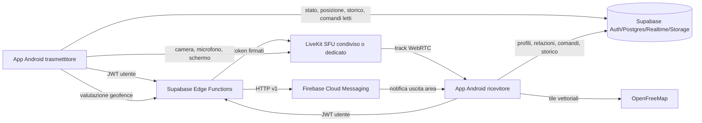

<!--
/**
 * @author Maurizio di Sabato <maurizio.disabato@xcconsulting.it>
 * @description Analisi tecnica e guida di riproduzione dell'architettura FindMe.
 * @modified 29.09.2026 - MDS | Documentati distanza TX-RX e messaggi overlay persistenti.
 * @modified 29.09.2026 - MDS | Documentati transazione di uscita area e retry FCM persistente.
 * @modified 24.09.2026 - MDS | Documentata la risoluzione multi-tenant dei provider LiveKit.
 */
-->
# FindMe — Analisi tecnica e guida di riproduzione

## 1. Obiettivo e criterio di fedeltà

Questo documento descrive l’architettura, i contratti dati, le integrazioni
esterne, le scelte implementative e le criticità risolte nell’attuale progetto
FindMe. Insieme a `docs/ANALISI_FUNZIONALE.md` costituisce la specifica per
ricostruire fedelmente il sistema.

Il codice e le migrazioni restano la fonte di verità. Non sostituire componenti
o semplificare i flussi di recovery senza verificare i problemi reali che tali
meccanismi risolvono.

## 2. Architettura generale



Separazione dei piani:

- **control plane**: Supabase Auth, PostgREST, Realtime, Edge Functions e coda
  `device_commands`;
- **data plane realtime**: LiveKit/WebRTC, aperto solo quando serve;
- **data plane asincrono**: Supabase Storage per messaggi vocali;
- **notifiche**: FCM soltanto per geofence;
- **mappe**: MapLibre Native con stile OpenFreeMap.

Questa separazione è fondamentale. Lo stato “online” dipende dagli heartbeat
REST e non prova che Realtime o LiveKit siano funzionanti.

## 3. Struttura del repository

Il progetto è un Gradle multi-module:

- `:core`: modelli, repository Supabase, policy pure e configurazione;
- `:transmitter`: app Android trasmettitore e foreground service;
- `:receiver`: app Android ricevitore, mappe, rendering e registrazioni;
- `supabase/migrations`: schema incrementale PostgreSQL;
- `supabase/functions`: Edge Functions Deno/TypeScript;
- `tools`: generatore PowerShell del QR provisioning;
- `docs`: setup, provisioning, handoff e analisi.

Package:

- core: `it.xcc.findme.core`;
- trasmettitore: `it.xcc.findme.transmitter`;
- ricevitore: `it.xcc.findme.receiver`.

Entrambe le app hanno label visibile **FindMe**, ma application ID e icone
launcher distinti.

## 4. Toolchain e versioni

Versioni da preservare o aggiornare soltanto con verifica completa:

- Gradle Wrapper 8.11.1;
- Android Gradle Plugin 8.9.1;
- Kotlin 2.2.21;
- Java/JVM 17;
- compileSdk 35;
- targetSdk 35;
- minSdk 26;
- Compose BOM 2025.04.01;
- Activity Compose 1.10.1;
- Lifecycle 2.9.0;
- Core KTX 1.16.0;
- coroutines Android 1.10.2;
- kotlinx serialization JSON 1.8.1;
- Supabase Kotlin BOM 3.5.0;
- Ktor OkHttp 3.0.3;
- AndroidX Browser 1.8.0 con versione `strictly`;
- LiveKit Android 2.20.1;
- MapLibre Android 11.11.0;
- Google Play Services Location 21.3.0;
- Firebase BOM 34.18.0;
- Google Services plugin 4.5.0;
- JUnit 4.13.2.

Versione corrente delle app:

- `versionCode = 5`;
- `versionName = 0.5.0`.

Repository Maven richiesti:

- Google;
- Maven Central;
- Gradle Plugin Portal;
- JitPack.

## 5. Configurazione locale e segreti

Creare `local.properties` da `local.properties.example`:

```properties
sdk.dir=C\:\\Android\\Sdk
SUPABASE_URL=https://PROJECT_REF.supabase.co
SUPABASE_PUBLISHABLE_KEY=sb_publishable_...
LIVEKIT_URL=wss://PROJECT.livekit.cloud
```

Il modulo core converte questi valori in campi `BuildConfig`.
`AppConfig.isConfigured` richiede:

- URL Supabase che inizi con `https://`;
- publishable key non vuota;
- URL LiveKit che inizi con `wss://`.

Non inserire nell’APK:

- Supabase `service_role`;
- Supabase secret key;
- `LIVEKIT_API_SECRET`;
- service account Firebase;
- password del keystore.

Segreti server-side:

- `LIVEKIT_URL`;
- `LIVEKIT_API_KEY`;
- `LIVEKIT_API_SECRET`;
- coppie opzionali di Edge Secrets LiveKit dedicate ai singoli ricevitori;
- `FIREBASE_SERVICE_ACCOUNT_BASE64`.

`SUPABASE_URL`, `SUPABASE_ANON_KEY` e
`SUPABASE_SERVICE_ROLE_KEY` sono forniti all’ambiente Edge Functions.
`receiver_service_configs` conserva soltanto URL e nomi dei secret dedicati:
API key e secret reali non devono mai essere scritti nel database.

## 6. Dipendenze per modulo

### 6.1 Core

Plugin Supabase installati nel client:

- Auth;
- PostgREST;
- Realtime;
- Functions;
- Storage.

Il trasporto usa Ktor OkHttp, necessario anche per WebSocket.

### 6.2 Trasmettitore

Dipende da:

- core;
- Compose/Material 3;
- lifecycle;
- Fused Location Provider;
- LiveKit Android.

Non usa CameraX direttamente: LiveKit crea e gestisce la track camera locale.

### 6.3 Ricevitore

Dipende da:

- core;
- Compose/Material 3 e icone extended;
- LiveKit Android;
- MapLibre Native;
- Firebase Messaging.

Il plugin Google Services viene applicato soltanto se esiste
`receiver/google-services.json`; in sua assenza la build rimane possibile, ma
le notifiche geofence remote non sono configurate.

## 7. Identità e autenticazione

### 7.1 Sessioni anonime

Abilitare in Supabase:
**Authentication → Providers → Anonymous Sign-Ins**.

Ogni installazione ha:

- UUID applicativo persistente in SharedPreferences;
- utente Supabase anonimo persistito dal client Auth;
- ownership DB legata a `auth.uid()`.

Le app non condividono credenziali: ricevitore e trasmettitori hanno utenti
anonimi distinti e accedono ai dati reciproci tramite relazione e RLS.

### 7.2 Un solo client per processo

`FindMeRepository` usa:

- `processClient` lazy singleton;
- mutex di autenticazione condiviso;
- timestamp refresh condiviso.

Non creare client Supabase indipendenti per Activity, Service o FCM service.
Client concorrenti possono ruotare lo stesso refresh token e provocare
`token expired`/refresh falliti.

### 7.3 Refresh esplicito

Auto-refresh lifecycle è disabilitato:

- `alwaysAutoRefresh = false`;
- `enableLifecycleCallbacks = false`.

Motivo: un foreground service sempre attivo non può dipendere dai callback
foreground dell’Activity.

`ensureAuthenticated()`:

1. serializza l’accesso con mutex;
2. usa `SystemClock.elapsedRealtime()`, che include deep sleep;
3. rinnova ogni 20 minuti o se forzato;
4. applica timeout di 20 secondi;
5. esegue `refreshCurrentSession()` o `signInAnonymously()`.

Non usare `System.nanoTime()` per questo intervallo: durante deep sleep può far
apparire recente un JWT già scaduto.

## 8. Modello dati Supabase

Applicare tutte le migrazioni in ordine lessicografico.

### 8.1 Enum

`device_role`:

- `receiver`;
- `transmitter`.

`device_command_type` finale:

- `start_audio`, `stop_audio`;
- `start_video`, `stop_video`;
- `switch_camera`;
- `start_screen`, `stop_screen`;
- `start_monitoring`, `stop_monitoring`;
- `play_voice_message`;
- `show_text_message`.

`voice_message_volume`:

- `low`, `medium`, `high`.

`voice_message_status`:

- `pending`;
- `downloading`;
- `playing`;
- `completed`;
- `failed`.

### 8.2 `devices`

Campi:

- `id uuid` PK, generato nell’app;
- `owner_id uuid` FK `auth.users`;
- `name` 1–80 caratteri;
- `role`;
- `created_at`.

La coppia `id, owner_id` è unica. RLS consente gestione al proprietario e
lettura dei trasmettitori ai ricevitori associati.

### 8.3 `receivers`

Campi principali:

- `device_id` PK/FK `devices`;
- `owner_id`;
- `name`;
- `pairing_code` univoco;
- domanda e hash risposta;
- frequenze tracking;
- heartbeat;
- polling comandi;
- raggio geofence;
- `created_at`.

Default:

- offline 60 s;
- online 10 s;
- storico 2x;
- solo movimento `true`;
- heartbeat 60 s;
- polling comandi 60 s;
- geofence 100 m.

Il trigger `assign_receiver_pairing_code` produce 10 caratteri esadecimali
maiuscoli da `pgcrypto`.

### 8.4 `receiver_transmitters`

Campi finali:

- `receiver_id`, `transmitter_id` PK composta;
- `paired_at`;
- `alias`;
- `live_tracking_until`;
- `live_tracking_persistent`;
- `live_history`;
- configurazione/stato geofence;
- payload, tentativi, prossima esecuzione ed errore della notifica geofence
  eventualmente pendente.

Un indice unico su `transmitter_id` impone un solo ricevitore per
trasmettitore.

### 8.5 `device_status`

Una riga per trasmettitore:

- `is_monitoring`;
- batteria 0–100;
- disponibilità camera/microfono;
- streaming camera/microfono/schermo;
- `screen_share_ready`;
- camera `front`/`back`;
- `last_heartbeat`.

I booleani media nel modello Kotlin usano `@EncodeDefault`. È indispensabile:
senza serializzazione esplicita di `false`, un upsert può omettere il campo e
lasciare nel DB uno stream erroneamente ON.

### 8.6 Posizione

`device_locations` contiene l’ultima posizione per device tramite upsert.

`location_history` è append-only per il trasmettitore:

- identity bigint;
- device;
- latitudine/longitudine;
- accuratezza;
- timestamp;
- indice `(device_id, recorded_at desc)`.

### 8.7 Comandi

`device_commands` contiene:

- identity bigint;
- device;
- enum comando;
- stato `pending/applied/failed`;
- timestamp creazione/applicazione;
- eventuale `voice_message_id`;
- eventuale `text_message_id`.

L’indice parziale sui pending accelera il recupero. Il constraint finale
richiede `voice_message_id` soltanto per `play_voice_message`.

### 8.8 Messaggi vocali

`voice_messages` contiene:

- UUID messaggio;
- ricevitore e trasmettitore;
- percorso Storage univoco;
- volume;
- durata 1.000–60.000 ms;
- stato ed eventuale errore massimo 300 caratteri;
- timestamp creazione, avvio e completamento.

Il bucket `voice-messages`:

- è privato;
- limite oggetto 2.097.152 byte;
- MIME consentito `audio/mp4`;
- path obbligatorio:
  `<receiverUuid>/<transmitterUuid>/<messageUuid>.m4a`.

### 8.9 Push token

`receiver_push_tokens` associa token/installazione al ricevitore e consente
gestione soltanto al proprietario via RLS.

### 8.10 Messaggi testuali

`text_messages` conserva UUID, ricevitore, trasmettitore, corpo normalizzato
1–500 caratteri, errore e timestamp. Gli stati sono `pending`,
`waiting_permission`, `displaying`, `dismissed`, `failed`. La RPC
`create_text_message` verifica ownership e pairing e crea nello stesso commit
record e comando. Il comando resta pending finché l’utente chiude l’overlay.

## 9. Migrazioni e ordine obbligatorio

1. `202609160001_findme.sql`: schema base, RLS, Realtime e retention.
2. `202609160002_device_pairing.sql`: ricevitori, relazioni e pairing.
3. `202609160003_receiver_access_challenge.sql`: challenge e relazione 1:1 lato
   trasmettitore.
4. `202609160004_verify_receiver_answer.sql`: verifica bcrypt service-role.
5. `202609160005_media_state.sql`: stato media e switch camera.
6. `202609170001_receiver_device_alias.sql`: alias e policy update.
7. `202609170002_tracking_performance.sql`: frequenze, lease e route.
8. `202609170003_tracking_policy_fix.sql`: elimina ricorsione RLS mediante
   funzione `security definer`.
9. `202609170004_geofence_alert.sql`: geofence, push token e RPC.
10. `202609170005_screen_mirroring.sql`: comandi/stato schermo.
11. `202609180001_delete_location_history.sql`: cancellazione autorizzata.
12. `202609200001_command_recovery.sql`: polling comandi configurabile.
13. `202609200002_voice_messages_schema.sql`: enum, tabella, bucket e policy.
14. `202609200003_voice_messages_rpc.sql`: creazione atomica record+comando.
15. `202609200004_voice_storage_policy_fix.sql`: ricrea helper/policy Storage.
16. `202609230001_fast_command_recovery.sql`: polling comandi a 5 secondi.
17. `202609230002_update_receiver_access_question.sql`: testo della domanda.
18. `202609240001_receiver_service_configs.sql`: servizi per ricevitore.
19. `202609290001_geofence_exit_tracking.sql`: uscita area atomica, tracking
    persistente e coda retry FCM.
20. `202609290002_online_interval_2s.sql`: frequenza online minima di 2 secondi.
21. `202609290003_text_messages_schema.sql`: messaggi testuali, RLS e comando.
22. `202609290004_text_messages_rpc.sql`: creazione atomica e retention.

Avvertenza PostgreSQL: l’uso di un nuovo valore enum nella stessa transazione
che lo aggiunge può fallire. Mantenere separate le migrazioni schema e RPC,
come nel repository.

## 10. RLS e funzioni SQL

Non disabilitare RLS per semplificare lo sviluppo.

Helper principali:

- `can_access_transmitter(uuid)`: vero per proprietario del trasmettitore o
  proprietario di un ricevitore associato;
- `can_read_receiver_tracking(uuid)`: permette al trasmettitore associato di
  leggere impostazioni del ricevitore senza policy ricorsive;
- `verify_receiver_answer(uuid,text)`: confronto bcrypt, eseguibile solo da
  service role;
- `can_upload_voice_message_object(text,text)`: autorizza il proprietario del
  ricevitore associato;
- `can_access_voice_message_object(text,text)`: autorizza ricevitore o
  trasmettitore associato.

RPC:

- `get_location_route`: campiona fino a 1.500 punti, preservando estremi;
- `evaluate_geofence`: calcola distanza Haversine sotto lock e rende
  idempotente la transizione, commuta i controlli rapidi e assegna il retry
  FCM dovuto;
- `delete_receiver_location_history`: verifica ownership e appartenenza di
  ogni UUID prima del delete;
- `create_voice_message`: verifica ricevitore, relazione e oggetto Storage,
  poi crea record e comando nella stessa transazione;
- `delete_expired_findme_data`: 30 giorni storico, 7 giorni comandi e reset
  lease scadute senza alterare il tracking persistente.

Programmare con `pg_cron` una chiamata giornaliera alla retention, per esempio
alle 03:15.

## 11. Supabase Realtime

La pubblicazione include:

- `devices`;
- `device_status`;
- `device_locations`;
- `device_commands`;
- `receivers`;
- `receiver_transmitters`.

Il ricevitore usa `selectAsFlow` e combina relazioni, devices, status e
locations in `MonitoredDevice`.

Il trasmettitore non deve affidarsi esclusivamente a Realtime per i comandi.
`FindMeRepository.commands()`:

1. esegue fetch REST iniziale prima della subscribe;
2. sottoscrive insert su `device_commands`;
3. a ogni evento rilegge tutti i pending via REST;
4. in parallelo esegue polling 30/60/120/300 secondi;
5. serializza i fetch con mutex;
6. mantiene il polling anche se la subscribe fallisce.

## 12. Edge Functions

### 12.1 `pair-device`

Input:

- `transmitter_device_id`;
- `pairing_code`.

Verifica JWT anonimo, ownership e ruolo transmitter. Il codice deve corrispondere
a `[A-F0-9]{10}`. Elimina la relazione precedente e inserisce quella nuova.

### 12.2 `receiver-access`

Input:

- transmitter UUID;
- risposta opzionale.

Senza risposta restituisce domanda e dati ricevitore. Con risposta:

- trim + lowercase;
- RPC bcrypt tramite client admin;
- ritardo 600 ms in caso negativo;
- restituisce soltanto booleano, mai hash.

### 12.3 `livekit-token`

Modalità:

- `publish`: solo il proprietario del transmitter;
- `subscribe`: solo proprietario di un receiver associato.

Stanza: `device-<transmitterUuid>`.

Token:

- TTL 10 minuti;
- grant publish o subscribe esclusivo;
- data publishing disabilitato.

### 12.4 `geofence-alert`

Il trasmettitore invoca la funzione con posizione corrente. La funzione:

1. autentica;
2. chiama `evaluate_geofence`;
3. termina senza invio se non esiste un evento nuovo o un retry scaduto;
4. recupera alias/nome e token;
5. ottiene OAuth2 dal service account;
6. invia FCM HTTP v1 ad alta priorità;
7. elimina token non registrati;
8. in caso di almeno una consegna confermata elimina il payload pendente;
9. in caso di errore conserva diagnostica sanitizzata e lascia il retry
   pendente. La RPC applica backoff 15/30/60/120/300 secondi e serializza le
   assegnazioni con `FOR UPDATE`.

Il payload dati contiene tipo, UUID, nome, distanza e raggio. Verificare con la
versione FCM in uso che l’identificativo salvato e il campo destinatario HTTP
v1 siano coerenti; il codice corrente registra l’identificativo Firebase
Installation e usa il campo `fid`.

## 13. Tracking posizione

### 13.1 Configurazione effettiva

`TrackingConfigResolver` combina settings del ricevitore e relazione.

Lease live valida:

- intervallo posizione = online;
- priorità GPS = high accuracy.

Senza lease:

- intervallo posizione = offline;
- priorità = balanced power accuracy.

Storico:

- base online soltanto se live tracking e `live_history`;
- altrimenti base offline;
- intervallo finale = base × moltiplicatore.

### 13.2 Solo movimento

Prima viene rispettato l’intervallo temporale. Poi:

- se `only_movement=false`, salva;
- se non esiste punto precedente, salva;
- altrimenti calcola distanza Haversine;
- soglia = media accuratezze, limitata fra 10 e 50 metri;
- salva soltanto se distanza ≥ soglia.

### 13.3 Location request

`LocationRequest`:

- intervallo dalla configurazione;
- min interval = metà dell’intervallo;
- callback sul main looper.

Ogni punto:

1. upsert posizione corrente con timeout;
2. se geofence attiva o notifica pendente, Edge Function;
3. valuta salvataggio storico sotto mutex.

## 14. Foreground service trasmettitore

`MonitoringService`:

- `START_STICKY`;
- `stopWithTask=false`;
- tipi camera, microfono, location, mediaProjection, mediaPlayback;
- scope `SupervisorJob + Dispatchers.IO`;
- partial wake lock non reference-counted;
- default network callback;
- Fused Location Provider;
- ScreenProjectionController;
- repository process-wide.

Loop concorrenti del control plane:

- osservazione settings/relazione;
- rivalutazione lease ogni secondo;
- heartbeat;
- health/refresh;
- media watchdog;
- comandi ibridi;
- segnale di recovery rete.

L’uscita di uno qualunque ricrea il piano dati. I retry usano 5, 10, 20, 40,
60 secondi.

Heartbeat:

- pubblicazione iniziale immediata;
- poi frequenza configurata;
- stale oltre `max(90 s, 2 × heartbeat)`;
- rinnovo autenticato e ricostruzione canali ogni 15 minuti.

## 15. Comandi e compattazione

Stato desiderato e stato effettivo sono separati:

- `desiredCameraStreaming`;
- `desiredMicrophoneStreaming`;
- `desiredScreenStreaming`;
- corrispondenti flag effettivi.

`CommandRecoveryPolicy.compact()` conserva l’ultimo comando per:

- video;
- audio;
- schermo;
- monitoraggio.

Non compatta:

- `switch_camera`;
- `play_voice_message`.

I comandi scartati perché superati vengono comunque riconosciuti come
applicati, impedendo replay infinito.

## 16. LiveKit e media on-demand

Il publisher richiede un token `publish`; il receiver un token `subscribe`.
La Edge Function ricava prima il ricevitore autorizzato dalla relazione
`receiver_transmitters`. Se esiste una riga in `receiver_service_configs`,
carica gli Edge Secrets indicati dalla riga e usa il relativo URL LiveKit;
altrimenti usa `LIVEKIT_URL`, `LIVEKIT_API_KEY` e `LIVEKIT_API_SECRET`
condivisi. La stanza è isolata con il nome
`receiver-<receiver_uuid>-device-<device_uuid>`.

Il contratto Android resta indipendente dal provider: `livekit-token` restituisce
sempre `url`, `room` e `token`. La configurazione dedicata è amministrativa,
protetta da RLS e non leggibile dai client. Firebase resta invece centrale:
`receiver_push_tokens.receiver_id` seleziona i destinatari senza introdurre
service account diversi per tenant.

`MediaConnectionPolicy.shouldConnect` è vero se almeno un media è richiesto.
Quando falso:

- il transmitter disconnette la room;
- il receiver non mantiene la subscription.

Quando vero:

1. viene creata/connessa la room;
2. camera/microfono usano API LiveKit;
3. schermo usa track custom source `SCREEN_SHARE`;
4. stato effettivo viene pubblicato in Supabase.

Watchdog:

- controllo ogni 5 secondi;
- verifica room e publication/track richieste;
- dopo tre fallimenti ricrea il publisher;
- una disconnessione Room azzera stato effettivo e avvia recovery esponenziale.

## 17. Rendering receiver

Usare due `TextureViewRenderer` distinti:

- camera;
- screen share.

Il binding deve basarsi su `Track.Source.CAMERA` e
`Track.Source.SCREEN_SHARE`, non soltanto sul tipo `VideoTrack`.

Accortezze essenziali:

- inizializzare ogni renderer una sola volta per lifecycle;
- mantenere l’istanza persistente attraverso ricomposizioni/cambio tab;
- non chiamare `release()` in un `DisposableEffect` che scatta al semplice
  cambio tab;
- rilasciare tutti i renderer soltanto durante disconnect/destroy definitivo;
- rimuovere sink dalla track corretta;
- pulire solo la sorgente disconnessa.

La doppia inizializzazione produce `Already initialized`; il rilascio
prematuro porta a video nero dopo cambio tab o reconnect.

Scaling:

- `RendererCommon.ScalingType.SCALE_ASPECT_FIT`;
- screen non specchiato;
- preview portrait con rapporto `576/1280`;
- camera e schermo non devono condividere crop/layout.

## 18. MediaProjection

### 18.1 Vincolo di piattaforma

Il Device Owner non può pre-concedere MediaProjection. Il token vive nel
processo e non sopravvive a reboot, update, force-stop o revoca.

### 18.2 Controller persistente

`ScreenProjectionController` mantiene:

- MediaProjection;
- VirtualDisplay;
- dimensioni cattura;
- callback stop;
- resize al cambio configurazione.

La cattura resta pronta indipendentemente dalla room LiveKit. Questo evita di
richiedere consenso a ogni switch remoto.

### 18.3 Capturer LiveKit

`ProjectionVideoCapturer` adatta il controller all’interfaccia LiveKit.

La track:

- nome `findme-screen`;
- source `SCREEN_SHARE`;
- `isScreencast=true`;
- 15 fps;
- dimensioni reali del controller;
- `adaptOutputToDimensions=false`.

Specificare dimensioni e disattivare l’adattamento evita crop/zoom errati delle
sorgenti portrait.

`ScreenCaptureDimensions.fit` limita il lato lungo a 1.280 pixel senza
upscaling, preserva il rapporto e arrotonda larghezza/altezza a valori pari per
compatibilità con encoder e WebRTC.

## 19. Registrazioni locali sul ricevitore

### 19.1 Stato comune

`LocalRecordingState`:

- Idle;
- Starting;
- Recording con elapsed;
- Finalizing.

Limite sicurezza: 30 minuti.

### 19.2 Output atomico

`PendingMediaOutput` crea un elemento MediaStore pending:

- camera/schermo: `Movies/FindMe`, MP4;
- audio: `Music/FindMe`, M4A;
- snapshot: `Pictures/FindMe`.

Solo dopo finalizzazione valida l’elemento diventa visibile. In caso di errore
va eliminato.

Su Android ≤ 9 serve `WRITE_EXTERNAL_STORAGE`; sui moderni Android si usa
scoped storage.

### 19.3 Video e schermo

`VideoMp4Recorder`:

- riceve frame LiveKit come sink;
- codifica H.264 con MediaCodec;
- usa EGL/GlRectDrawer/VideoFrameDrawer;
- muxa con MediaMuxer;
- supporta `RecordingKind.VIDEO` e `SCREEN`;
- non include audio.

### 19.4 Audio

`AudioM4aRecorder` riceve PCM dalla track remota tramite `AudioTrackSink`,
codifica AAC e produce M4A.

### 19.5 Arresti automatici

Finalizzare su:

- cambio tab;
- stop dello stream;
- perdita track/disconnessione;
- uscita dal dettaglio;
- timeout 30 minuti;
- distruzione Activity.

## 20. Snapshot video

La fotografia usa il frame remoto già renderizzato, non apre una camera locale
sul ricevitore.

Flusso:

1. acquisire frame/bitmap;
2. salvare JPEG in `Pictures/FindMe`;
3. finalizzare MediaStore;
4. mostrare `SnapshotCaptureAnimation`;
5. non usare toast con path.

## 21. Messaggi vocali asincroni

### 21.1 Registrazione receiver

`VoiceMessageRecorder` usa `MediaRecorder`:

- contenitore MPEG-4;
- encoder AAC;
- mono, 44.100 Hz, 64 kbit/s;
- file temporaneo M4A;
- permesso `RECORD_AUDIO` richiesto con Activity Result API;
- durata 1–60 secondi.

Non reintrodurre `onRequestPermissionsResult`, deprecato.

### 21.2 Upload atomico

`sendVoiceMessage()`:

1. valida durata e massimo 2 MiB;
2. genera path deterministico;
3. carica Storage con MIME `audio/mp4`, senza upsert;
4. invoca `create_voice_message`;
5. se RPC fallisce, elimina l’oggetto appena caricato.

La RPC impedisce record/comandi senza file e associazioni arbitrarie.

### 21.3 Playback trasmettitore

Sotto `voicePlaybackMutex`:

1. carica metadati;
2. evita replay se già completed;
3. stato downloading;
4. download autenticato;
5. scrittura cache privata;
6. salvataggio volume media corrente;
7. calcolo 25/60/100%, con `roundToInt`;
8. richiesta audio focus transiente;
9. `voiceMessagePlaying=true`;
10. sincronizzazione media, che sospende il microfono desiderato;
11. playback MediaPlayer come speech/media;
12. completed e delete Storage;
13. finally: volume, audio focus, file, flag e microfono ripristinati.

In errore: stato failed e messaggio generico massimo 300 caratteri.

## 22. Geofence e FCM

Il centro e il raggio sono salvati nella relazione. Il trasmettitore chiama
`geofence-alert` se la geofence è ON oppure se una notifica è ancora pendente.
Questi flag sono anche nella cache locale, così un riavvio offline non perde il
retry.

La distanza è Haversine con raggio terrestre 6.371.000 m. `evaluate_geofence`
blocca la relazione `FOR UPDATE`. Alla prima uscita spegne la geofence, azzera
centro e raggio, imposta `live_tracking_persistent=true`, abilita
`live_history` e crea il payload FCM nello stesso commit. Le invocazioni
successive assegnano un solo retry scaduto per volta; la Edge Function rimuove
il pending soltanto dopo una risposta FCM positiva.

Setup Firebase:

1. creare progetto;
2. registrare package `it.xcc.findme.receiver`;
3. copiare `google-services.json` in `receiver/`;
4. abilitare FCM API;
5. generare service account JSON;
6. codificarlo in Base64 e impostare `FIREBASE_SERVICE_ACCOUNT_BASE64`;
7. deploy `geofence-alert`;
8. rebuild/reinstall receiver;
9. aprire app e concedere notifiche.

`FindMeMessagingService` crea la notifica locale e la apre sul receiver.

## 23. Mappe e storico

MapLibre Native carica:
`https://tiles.openfreemap.org/styles/liberty`.

Non servono API key. Mantenere attribuzione e considerare assenza SLA
dell’istanza pubblica.

`get_location_route`:

- intervallo autorizzato;
- ordine cronologico;
- stride calcolato lato SQL;
- massimo 1.500;
- primo e ultimo preservati.

La lista separata usa PostgREST:

- ordine decrescente;
- pagina 50;
- richiesta 51 righe per calcolare `hasMore`.

Il rendering storico usa soltanto il prefisso della route fino allo slider.

Le view MapLibre dentro Compose devono gestire correttamente intercettazione
touch: il parent scroll non deve sottrarre gesture a pan/zoom.

La verifica distanza usa il GPS del receiver soltanto in foreground e non lo
pubblica. `DistanceMap` riceve il punto TX da Realtime, disegna il punto RX
locale, una `LineLayer` tratteggiata e inquadra entrambi con `LatLngBounds`.
La distanza usa lo stesso calcolo Haversine del resolver tracking.

## 23.1 Overlay messaggi testuali

`TextOverlayController` usa `TYPE_APPLICATION_OVERLAY`, pannello centrale
all’85% dello schermo, bordo neon e autosize. `SYSTEM_ALERT_WINDOW` è un
permesso speciale: Device Owner non lo concede automaticamente. Se manca, il
messaggio passa a `waiting_permission`, il comando non viene confermato e il
servizio sorveglia l’autorizzazione. Una volta concessa, il piano comandi viene
riavviato; soltanto la X imposta `dismissed` e `applied`. L’overlay non blocca
la gestione degli altri comandi e la coda mantiene l’ordine di creazione.

## 24. Power management

### 24.1 Trasmettitore

Permessi:

- `WAKE_LOCK`;
- `REQUEST_IGNORE_BATTERY_OPTIMIZATIONS`.

Il partial wake lock resta acquisito durante il servizio per mantenere timer,
heartbeat e recovery in deep sleep.

Device Owner non neutralizza ogni policy OEM. Su Xiaomi/HyperOS:

- batteria → Nessuna restrizione;
- autostart;
- eventualmente blocco app nel task manager.

### 24.2 Ricevitore

`ReceiverPowerPolicy.shouldProtectMedia` considera:

- tre stream;
- tre registrazioni.

Quando vero:

- `FLAG_KEEP_SCREEN_ON`;
- partial wake lock;
- sessione mantenuta se `onStop` deriva da schermo non interattivo.

Se l’utente passa volontariamente ad altra app con schermo interattivo, il
comportamento può chiudere media per evitare attività invisibile indesiderata.

## 25. Fullscreen e orientamento

Manifest receiver:
`configChanges="orientation|screenSize"`.

Mappe fullscreen:

- `SCREEN_ORIENTATION_LANDSCAPE`, non sensor landscape;
- immersive system bars.

Mirroring fullscreen:

- `SCREEN_ORIENTATION_PORTRAIT`, non sensor portrait.

Uscita:

- ripristino `SCREEN_ORIENTATION_UNSPECIFIED`;
- show system bars;
- ripristino decor fitting.

Usare orientamenti fissi impedisce di mostrare l’opzione/animazione di
auto-rotazione richiesta dal sistema mentre si entra nel fullscreen.

## 26. Device Owner e provisioning QR

### 26.1 Componenti DPC

Manifest trasmettitore:

- `FindMeDeviceAdminReceiver`;
- `GetProvisioningModeActivity`;
- `PolicyComplianceActivity`;
- `BootReceiver`.

Android 12+:

- `ACTION_GET_PROVISIONING_MODE`;
- ritorno `PROVISIONING_MODE_FULLY_MANAGED_DEVICE`;
- `ACTION_ADMIN_POLICY_COMPLIANCE`.

Legacy:

- `PROFILE_PROVISIONING_COMPLETE`.

`ProvisioningPolicy` normalizza e salva `findme_receiver_code`; la compliance
chiede al DevicePolicyManager di concedere i permessi gestibili.

Ogni `setPermissionGrantState` deve essere isolato in `runCatching`: un singolo
permesso non concedibile non deve interrompere tutto il provisioning.

### 26.2 Firma release

Creare una sola chiave RSA 4096 e conservarla. `keystore.properties` contiene:

- storeFile;
- storePassword;
- keyAlias;
- keyPassword.

Il Gradle transmitter configura signing release soltanto se il file esiste.
Aggiornamenti futuri devono usare la stessa chiave.

### 26.3 APK e QR

L’APK deve essere:

- firmato;
- disponibile a URL HTTPS diretto;
- senza cookie/auth;
- identico al file usato per checksum.

`tools/New-FindMeProvisioningQr.ps1`:

- SHA-256;
- Base64 URL-safe senza padding;
- componente DPC;
- URL APK;
- checksum;
- admin extras;
- Wi-Fi opzionale WPA/WEP/NONE;
- output JSON UTF-8 senza BOM;
- QR 1000 px, error correction M tramite `npx qrcode`;
- generazione interamente locale.

Non committare QR/JSON se contengono Wi-Fi o codice.

### 26.4 Procedura dispositivo

1. factory reset;
2. sei tap nel Setup Wizard;
3. rete/lettore QR se richiesto;
4. scansione;
5. download, checksum, installazione;
6. assegnazione Device Owner;
7. compliance;
8. apertura app e challenge;
9. monitoraggio e MediaProjection.

Account già presenti impediscono Device Owner. Il comando ADB di sviluppo non
passa admin extras.

## 27. Manifest e permessi

### 27.1 Trasmettitore

- INTERNET;
- CAMERA;
- RECORD_AUDIO;
- FINE/COARSE/BACKGROUND_LOCATION;
- POST_NOTIFICATIONS;
- RECEIVE_BOOT_COMPLETED;
- ACCESS_NETWORK_STATE;
- REQUEST_IGNORE_BATTERY_OPTIMIZATIONS;
- WAKE_LOCK;
- MODIFY_AUDIO_SETTINGS;
- FOREGROUND_SERVICE;
- FGS camera, microphone, location, mediaProjection, mediaPlayback.

Camera e microfono sono feature required.

### 27.2 Ricevitore

- INTERNET;
- RECORD_AUDIO per messaggi vocali;
- POST_NOTIFICATIONS;
- ACCESS_NETWORK_STATE;
- WAKE_LOCK;
- WRITE_EXTERNAL_STORAGE soltanto fino API 28.

Backup disabilitato in entrambe le app.

## 28. Build, test e distribuzione

Prerequisiti:

- JDK 17;
- Android SDK 35;
- spazio libero sufficiente;
- configurazione locale.

Comandi:

```powershell
.\gradlew.bat test
.\gradlew.bat :transmitter:assembleDebug :receiver:assembleDebug
.\gradlew.bat :transmitter:assembleRelease
```

Test presenti:

- online/offline e serializzazione modelli;
- access challenge;
- tracking resolver;
- recovery/timeout/poll/media watchdog;
- compattazione comandi;
- power policy;
- cancellazione storico;
- voice policy;
- recording policy;
- provisioning;
- dimensioni screen capture.

Prima di consegnare:

1. test unitari;
2. lint dei moduli modificati;
3. assemble debug;
4. installazione su entrambi i device;
5. test senza USB e con schermo bloccato;
6. test rete off/on;
7. test tutte le sorgenti LiveKit;
8. verifica file galleria;
9. verifica messaggio offline;
10. verifica geofence e fullscreen.

Per macchine con C: piccolo è possibile spostare `GRADLE_USER_HOME`, TEMP,
project cache e build directory su un disco esterno. La configurazione deve
essere applicata anche all’IDE, non soltanto alla singola shell, altrimenti
Cursor/Gradle ricreano `.gradle` su C:. Un HDD USB rende la prima build molto
più lenta e non deve scollegarsi durante unzip/compile.

## 29. Problemi reali incontrati e soluzioni da non perdere

### Token scaduto e transmitter offline

Cause:

- più client Supabase nello stesso processo;
- refresh legato al lifecycle;
- timer non affidabili in deep sleep;
- aggressività OEM.

Soluzione combinata:

- client singleton;
- mutex refresh;
- refresh esplicito;
- elapsedRealtime;
- wake lock;
- network callback;
- retry e rinnovo canali.

### Online ma comandi bloccati

L’heartbeat REST continuava mentre Realtime era fermo. Soluzione:

- fetch iniziale;
- Realtime + polling REST indipendente;
- watchdog control plane;
- compattazione arretrati.

### Video/schermo nero o `Already initialized`

Cause:

- renderer reinizializzato nelle ricomposizioni;
- release al cambio tab;
- binding senza distinguere source.

Soluzione:

- renderer persistenti;
- set degli inizializzati;
- release centralizzato;
- source-aware binding.

### Schermo zoomato/croppato

Cause:

- container fisso;
- scaling crop;
- adattamento codec della sorgente portrait.

Soluzione:

- aspect-fit;
- preview `576/1280`;
- capture dimensions esplicite;
- `adaptOutputToDimensions=false`;
- source screencast.

### Fullscreen nero

Il renderer era stato rilasciato dal preview prima del riuso. La track e il
renderer devono restare vivi attraversando la navigazione fullscreen.

### Video OFF non fermava

Non basta cambiare UI: il comando deve modificare stato desiderato,
disabilitare publication e pubblicare esplicitamente i booleani `false`.

### RLS recursion

Policy che interrogano tabelle protette reciprocamente possono ricorrere.
Usare helper `security definer`, `stable`, `search_path=''`, privilegi minimi.

### Upload Storage RLS negato

Le policy inline basate su path e join erano fragili. La soluzione usa helper
`security definer` e mantiene policy Storage semplici.

### Enum PostgreSQL

Non usare un nuovo valore enum nella stessa transazione in un vincolo/RPC.
Separare le migrazioni.

### Volume vocale errato

`toInt()` tronca 3,75 a 3. Usare `roundToInt()` per la percentuale.

### Deep sleep e blocco receiver

La sola connessione LiveKit non impedisce la sospensione. Servono policy
esplicite, wake lock e distinzione fra blocco schermo e cambio app.

### MediaProjection

Non promettere persistenza oltre la vita del token/processo. Il Device Owner
non cambia questo vincolo.

### Mappe poco fluide

Il parent Compose può intercettare touch. Dare priorità alle gesture MapLibre e
non sovrapporre aree scrollabili che consumano gli eventi.

### Build senza spazio

Native libraries LiveKit/MapLibre generano trasformazioni e strip molto
voluminosi. Pulire intermedi, mantenere diversi GB liberi o spostare tutte le
cache/build, non soltanto l’APK finale.

## 30. Limiti e rischi noti

- La validazione QR deve essere ripetuta sui Setup Wizard Xiaomi/Samsung
  effettivamente distribuiti.
- OpenFreeMap pubblico non offre SLA.
- I free tier Supabase/LiveKit vanno monitorati per utenti, storage, egress e
  participant-minutes.
- Token LiveKit durano 10 minuti; il recovery deve richiederne uno nuovo.
- Registrazioni video non includono audio.
- Screen share non include audio interno.
- Non esistono ancora test strumentali completi Android 14/15.
- Non esiste ancora pipeline CI/release protetta.
- Non sono implementate miniature simultanee multi-device/simulcast nella
  home.
- FCM va verificato end-to-end con il contratto destinatario corrente.

## 31. Sequenza consigliata per riprodurre il progetto

1. creare progetto Gradle e tre moduli con versioni indicate;
2. implementare modelli core e DeviceIdentity;
3. creare client Supabase singleton;
4. applicare migrazioni nell’ordine esatto;
5. abilitare anonymous auth e retention;
6. implementare/deploy Edge Functions;
7. configurare LiveKit e secrets;
8. implementare registrazione receiver e pairing;
9. implementare access challenge transmitter;
10. implementare foreground service con posizione/heartbeat;
11. implementare coda comandi ibrida;
12. aggiungere LiveKit on-demand camera/audio;
13. aggiungere UI receiver e renderer persistenti;
14. aggiungere tracking adattivo e storico;
15. aggiungere geofence/FCM;
16. aggiungere registrazioni/snapshot;
17. aggiungere MediaProjection e screen source;
18. aggiungere messaggi vocali/Storage;
19. aggiungere recovery, wake lock e fullscreen;
20. implementare DPC, signing e QR;
21. eseguire test reali senza USB, in deep sleep e con rete intermittente;
22. aggiornare sempre entrambi gli APK e il backend in modo compatibile.

## 32. File chiave

Core:

- `core/src/main/java/it/xcc/findme/core/Models.kt`;
- `FindMeRepository.kt`;
- `DeviceIdentity.kt`;
- `EffectiveTrackingConfig.kt`;
- `ConnectionRecoveryPolicy.kt`;
- `CommandRecoveryPolicy.kt`;
- `ReceiverPowerPolicy.kt`;
- `VoiceMessagePolicy.kt`.

Trasmettitore:

- `MainActivity.kt`;
- `MonitoringService.kt`;
- `DeviceOwnerSupport.kt`;
- `ProvisioningActivities.kt`;
- `screen/ScreenProjectionController.kt`;
- `screen/ProjectionVideoCapturer.kt`.

Ricevitore:

- `ReceiverActivity.kt`;
- `ReceiverHomeScreen.kt`;
- `DeviceDetailScreen.kt`;
- `TrackingSettingsScreen.kt`;
- `LocationHistoryScreen.kt`;
- renderer/mappe/recording sotto lo stesso package.

Backend:

- tutte le migrazioni sotto `supabase/migrations`;
- quattro funzioni sotto `supabase/functions`;
- `tools/New-FindMeProvisioningQr.ps1`.

Documentazione operativa:

- `README.md`;
- `docs/EXTERNAL_SETUP.md`;
- `docs/QR_PROVISIONING.md`;
- `docs/HANDOFF.md`;
- `docs/ANALISI_FUNZIONALE.md`.
