<!--
/**
 * @author Infinity
 * @description Manuale operativo dell'app FindMe Ricevitore.
 * @modified 01.10.2026 - Infinity | Aggiunti raggi brevi e modifica domanda/risposta.
 * @modified 29.09.2026 - MDS | Aggiunti verifica distanza e tab messaggio.
 * @modified 29.09.2026 - MDS | Aggiornato il comportamento dell'avviso uscita area.
 */
-->
# FindMe — Manuale utente Ricevitore

**Versione app:** 0.5.0 · **Manuale:** settembre 2026

| Documento correlato | Collegamento |
| --- | --- |
| Manuale trasmettitore | [`MANUALE_UTENTE_TRASMETTITORE.md`](MANUALE_UTENTE_TRASMETTITORE.md) |
| Analisi funzionale / tecnica | [`ANALISI_FUNZIONALE.md`](ANALISI_FUNZIONALE.md) · [`ANALISI_TECNICA.md`](ANALISI_TECNICA.md) |

## 1. A cosa serve

L’app FindMe Ricevitore consente di gestire uno o più telefoni trasmettitori
associati. Da un’unica interfaccia è possibile:

- controllare stato online e batteria;
- vedere posizione attuale e storico;
- attivare video, audio o mirroring dello schermo;
- scattare foto e registrare localmente;
- inviare messaggi vocali asincroni;
- configurare frequenze, storico e avvisi di uscita area.

> Le schermate di questo manuale provengono da dispositivi reali. Codici,
> identificativi, nomi e posizioni sono stati oscurati per tutelare la privacy.

## 2. Primo avvio

Al primo avvio FindMe crea automaticamente un’identità tecnica anonima. Non
sono richieste email o password.

La home mostra il ricevitore e i trasmettitori associati.

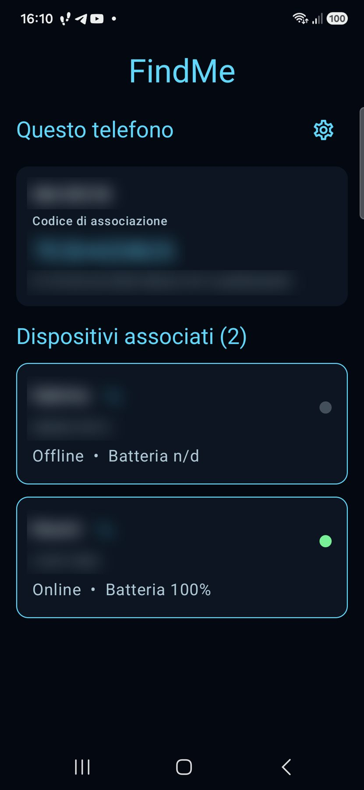

### 2.1 Dati di questo telefono

La card **Questo telefono** contiene:

- nome del ricevitore;
- **Codice di associazione** di 10 caratteri;
- ID tecnico dell’installazione.

Il codice serve per associare un trasmettitore. Può essere inserito nel QR di
provisioning oppure digitato nella dashboard del trasmettitore. Trattarlo come
un dato riservato e comunicarlo solo durante la configurazione.

### 2.2 Elenco dei trasmettitori

Il titolo **Dispositivi associati (N)** indica quanti trasmettitori sono legati
al ricevitore. Ogni card mostra:

- alias o nome del telefono;
- nome originale, se è stato impostato un alias;
- stato **Online** o **Offline**;
- livello batteria o `n/d`;
- pallino verde quando il monitoraggio è realmente attivo.

**Online** significa che è arrivato un heartbeat recente. Non significa che
camera, microfono o schermo siano già in trasmissione: questi flussi sono
sempre avviati su richiesta.

### 2.3 Modificare l’alias

1. Toccare la piccola matita accanto al nome.
2. Inserire un **Nome personalizzato**.
3. Confermare.

Il limite è 80 caratteri. Salvando un valore vuoto viene rimosso l’alias e
torna visibile il nome originale.

### 2.4 Aprire un dispositivo

Toccare la card del trasmettitore. La pagina di dettaglio mostra una testata
compatta con:

- simbolo `‹` per tornare alla home;
- nome del dispositivo;
- stato online e batteria;
- pallino del monitoraggio.

Sotto la testata sono disponibili cinque icone:

1. puntatore: **Posizione**;
2. videocamera: **Video**;
3. microfono: **Audio**;
4. schermo: **Mirroring**.
5. fumetto: **Messaggio**.

Uscendo dal dettaglio FindMe ferma stream e registrazioni e scarta
un’eventuale bozza vocale.

## 3. Configurazioni generali

Toccare l’ingranaggio nella sezione **Questo telefono**.

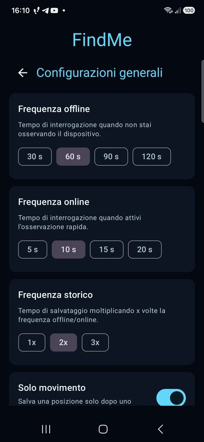

Le modifiche vengono salvate subito e valgono per tutti i trasmettitori
associati.

### 3.1 Frequenza offline

Definisce ogni quanto viene interrogata la posizione quando il dispositivo non
è osservato in modalità rapida:

- 30, 60, 90 o 120 secondi.

Un intervallo breve offre maggiore dettaglio ma usa più batteria e traffico.

### 3.2 Frequenza online

È usata quando si attiva **Aggiornamento rapido**:

- 2, 5, 10, 15 o 20 secondi.

### 3.3 Frequenza storico

Moltiplica la frequenza di posizione prima di salvare un punto:

- 1x, 2x o 3x.

Esempio: frequenza offline 60 secondi e storico 2x producono, in condizioni
normali, un punto ogni 120 secondi.

### 3.4 Solo movimento

Se ON, una posizione viene salvata nello storico solo dopo uno spostamento
significativo. Riduce dati e consumo quando il telefono è fermo.

### 3.5 Raggio, heartbeat e controllo comandi

Scorrere verso il basso per le opzioni avanzate.

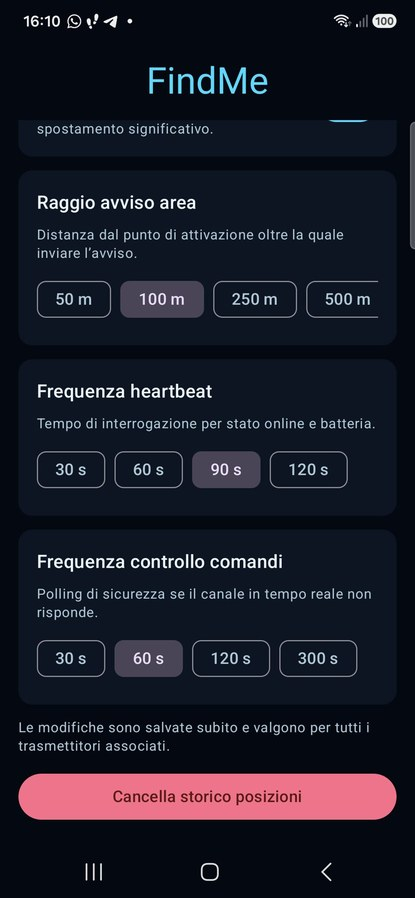

- **Raggio avviso area**: 10, 25, 50, 100, 250, 500 o 1000 metri.
- **Frequenza heartbeat**: 30, 60, 90 o 120 secondi.
- **Frequenza controllo comandi**: 30, 60, 120 o 300 secondi.

Il polling comandi è un controllo di sicurezza: recupera le richieste anche se
il canale realtime si blocca. Valori più brevi aumentano reattività e traffico.

## 4. Posizione

La tab Posizione è selezionata automaticamente quando si apre un dispositivo.

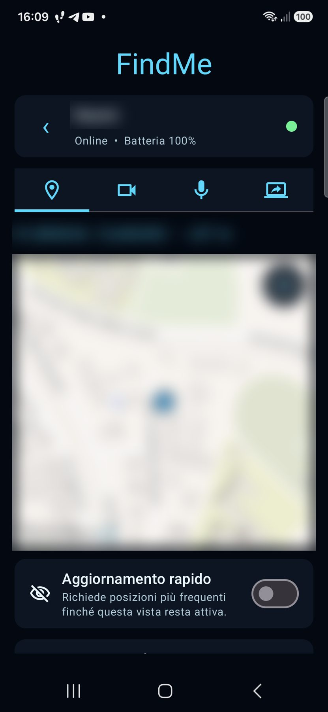

La schermata mostra:

- coordinate con sei decimali;
- accuratezza stimata in metri;
- marker sulla mappa;
- eventuale cerchio dell’avviso area;
- pulsante fullscreen nell’angolo della mappa.

Se compare **Posizione non ancora disponibile**, verificare che il
trasmettitore sia online, abbia il GPS attivo e abbia concesso la posizione.
La mappa OpenFreeMap può impiegare alcuni secondi: attendere il caricamento
completo delle tile prima di interpretare la vista.

### 4.1 Aggiornamento rapido

Attivare lo switch per ricevere posizioni con la **Frequenza online**
configurata. È disponibile solo quando il trasmettitore è online.

La modalità ha una scadenza di sicurezza di circa 90 secondi e viene rinnovata
automaticamente finché questa vista rimane attiva. Uscendo torna la frequenza
offline.

### 4.2 Storico rapido

È attivabile soltanto insieme ad **Aggiornamento rapido**. Usa la frequenza
online anche come base per salvare lo storico, mantenendo il moltiplicatore
configurato.

### 4.3 Avviso uscita area

1. Impostare prima il raggio nelle configurazioni generali.
2. Aprire la tab Posizione.
3. Attendere una posizione valida.
4. Attivare **Avviso uscita area**.

La posizione corrente diventa il centro dell’area. Quando il trasmettitore
passa dall’interno all’esterno, FindMe esegue automaticamente tre azioni:

1. spegne **Avviso uscita area**;
2. accende **Aggiornamento rapido** e **Storico rapido**;
3. invia una notifica al ricevitore.

I due controlli rapidi restano attivi anche bloccando il telefono, chiudendo il
dettaglio o riaprendo l’app. Per tornare alle frequenze normali occorre
disattivare manualmente **Aggiornamento rapido**. Per sorvegliare nuovamente
l’area, riattivare **Avviso uscita area** dalla posizione desiderata.

Se la consegna Firebase incontra un errore temporaneo, FindMe conserva
l’avviso e lo ritenta automaticamente.

Per notifiche anche ad app chiusa devono essere configurate e autorizzate le
notifiche Firebase del ricevitore.

### 4.4 Mappa a schermo intero

Premere l’icona fullscreen sulla mappa.

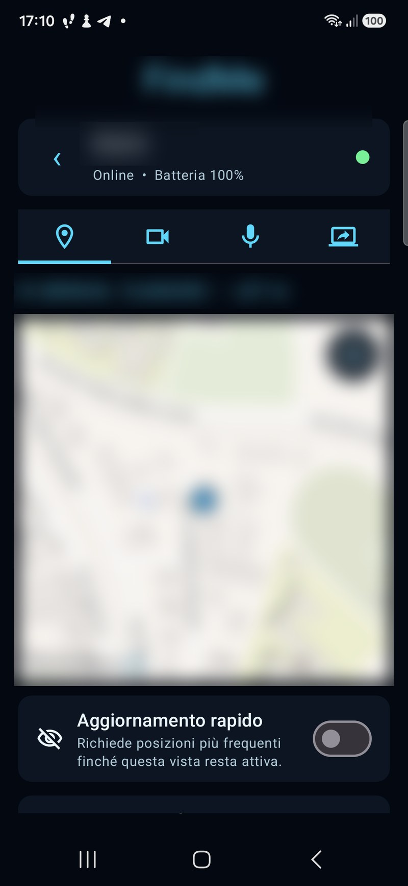

Il telefono viene bloccato temporaneamente in orizzontale:

- la mappa occupa la parte sinistra;
- coordinate e controlli rimangono nel pannello destro;
- le barre Android vengono nascoste;
- pan, zoom e rotazione della mappa restano disponibili.

Usare il controllo nel pannello destro o il tasto Indietro per uscire.
Orientamento e barre vengono ripristinati automaticamente.

### 4.5 Verifica distanza

Sotto **Consulta storico posizioni**, premere **Verifica distanza** e concedere
la posizione al ricevitore. La mappa mostra il trasmettitore in blu, il
ricevitore in rosso e una linea tratteggiata fra i due. Sopra sono indicate
coordinate e accuratezza: il ricevitore è identificato da **Io**, mentre il
trasmettitore usa il suo nome personalizzato. Sotto è riportata la distanza
in linea d’aria, in metri sotto 1 km e in chilometri da 1 km in poi.

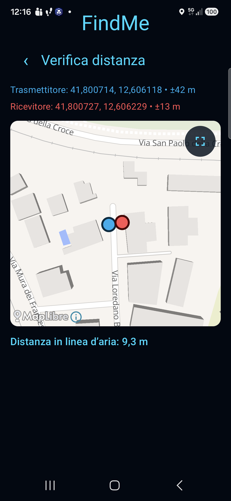

La frequenza segue lo switch **Aggiornamento rapido** già presente: online se
attivo, offline se disattivato. Il GPS del ricevitore viene usato solo mentre
questa pagina è aperta. L’icona fullscreen apre la mappa orizzontale; usare la
freccia o Indietro per tornare.

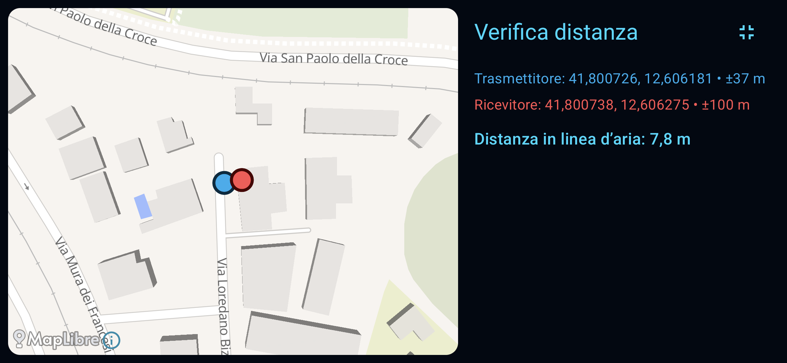

## 5. Storico posizioni

Dalla tab Posizione, scorrere in basso e premere
**Consulta storico posizioni**.

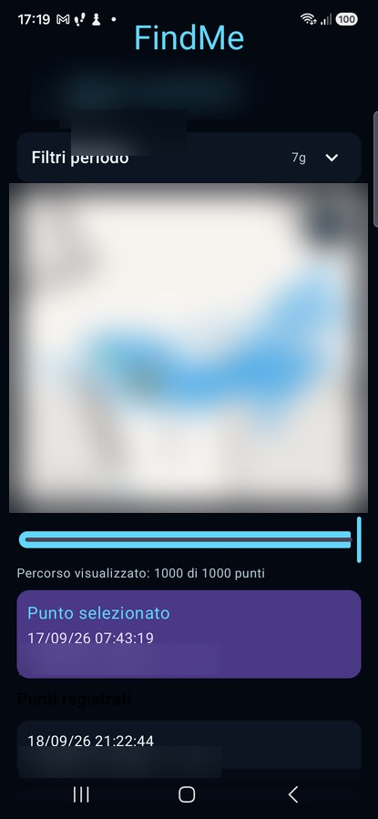

All’apertura viene eseguita una ricerca sulle ultime 24 ore. I filtri sono
compressi per lasciare più spazio alla mappa.

### 5.1 Filtrare il periodo

Premere la freccia a destra di **Filtri periodo**.

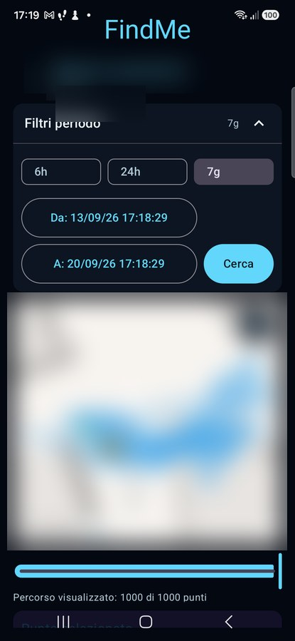

È possibile scegliere:

- ultime 6 ore;
- ultime 24 ore;
- ultimi 7 giorni;
- intervallo personalizzato **Da/A**.

Per l’intervallo personalizzato scegliere data e ora, quindi premere
**Cerca**. L’inizio deve precedere la fine e ogni ricerca può coprire al
massimo 7 giorni. I dati vengono conservati per 30 giorni.

### 5.2 Percorso, slider e punti

Quando ci sono dati:

- la mappa mostra il percorso fino al punto selezionato;
- lo slider si apre sull’ultimo punto;
- spostandolo verso sinistra il percorso viene ridisegnato progressivamente;
- una card mostra data e ora, coordinate e accuratezza;
- la lista **Punti registrati** mostra 50 righe per volta.

I timestamp includono i secondi. Premere **Carica altri 50 punti** quando
disponibile.

Scorrendo verso il basso compare l’elenco **Punti registrati** con data, ora,
coordinate e accuratezza per ogni riga.

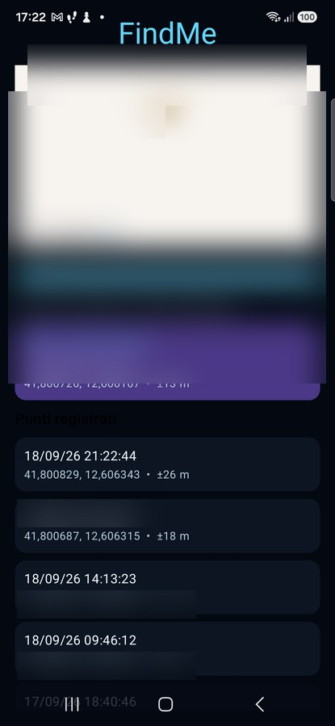

### 5.3 Fullscreen dello storico

L’icona fullscreen sulla mappa apre la modalità immersiva: percorso a sinistra
e, a destra, slider e dettaglio del punto selezionato (senza l’elenco completo).
Usare **Torna allo storico** o Indietro per chiudere.

## 6. Video

Toccare l’icona videocamera.

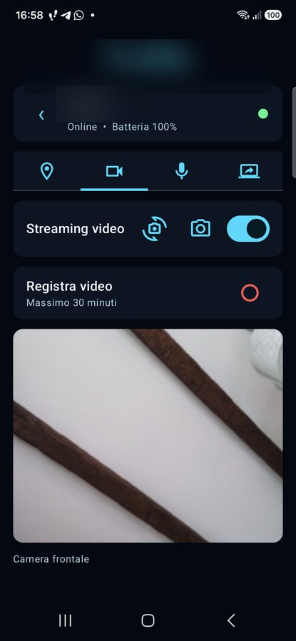

Nella schermata sopra lo switch **Streaming video** è attivo e l’anteprima
mostra il flusso remoto (in questo esempio dalla **camera frontale**).

### 6.1 Avviare e fermare il video

1. Verificare che il dispositivo sia online.
2. Attivare **Streaming video**.
3. Attendere qualche secondo finché l’anteprima non è nitida (connessione LiveKit
   e fotocamera remota).
4. Spegnere lo switch per terminare.

LiveKit viene collegato soltanto mentre almeno uno stream è attivo.

### 6.2 Cambiare fotocamera

Con video attivo premere l’icona con fotocamera e frecce. Il comando alterna
camera frontale e posteriore. Attendere di nuovo qualche secondo dopo il
cambio prima di valutare la qualità dell’immagine. Durante una registrazione
video il cambio è disabilitato.

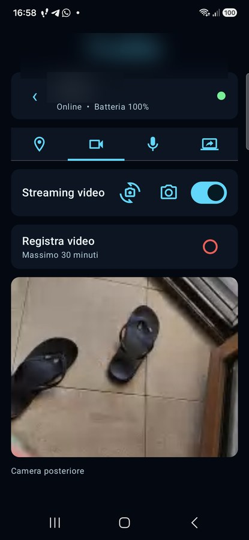

### 6.3 Scattare una foto

Con video attivo premere l’icona macchina fotografica. Il fotogramma corrente
viene salvato in:

`Galleria > Pictures > FindMe`

Una miniatura animata si riduce e si sposta verso il basso a destra; non viene
mostrato un messaggio testuale.

### 6.4 Registrare un video

1. Avviare lo streaming.
2. Premere il cerchio REC nella card **Registra video**.
3. Controllare il timer.
4. Premere nuovamente per fermare.

Il file MP4 viene salvato in:

`Galleria > Movies > FindMe`

La registrazione contiene il video H.264 senza audio, dura al massimo 30
minuti e viene finalizzata automaticamente se si spegne lo stream, si cambia
tab o si lascia il dettaglio.

## 7. Audio

Toccare l’icona microfono.

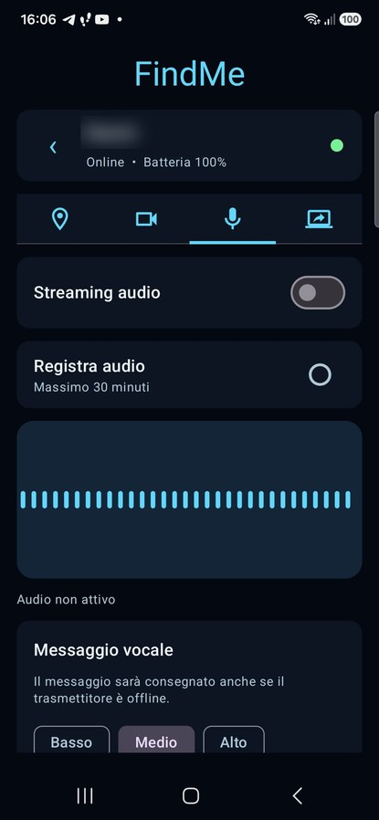

### 7.1 Ascolto e indicatore livello

Attivare **Streaming audio**. Il grafico azzurro rappresenta il livello audio
ricevuto in tempo reale. Spegnere lo switch per terminare l’ascolto.

### 7.2 Registrare l’audio

1. Avviare lo streaming audio.
2. Premere REC nella card **Registra audio**.
3. Premere nuovamente per terminare.

Il file AAC/M4A viene salvato in:

`Musica > FindMe`

La durata massima è 30 minuti. Il file viene chiuso automaticamente al cambio
tab, allo stop dello stream o all’uscita dal dettaglio.

### 7.3 Inviare un messaggio vocale

Scorrere fino alla card **Messaggio vocale**.

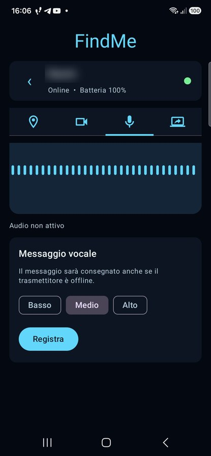

1. Scegliere **Basso**, **Medio** o **Alto**.
2. Premere **Registra**.
3. Parlare per almeno 1 secondo e non oltre 60 secondi.
4. Premere **Ferma**.
5. Ascoltare/valutare la durata mostrata.
6. Premere **Invia** oppure **Annulla**.

Il messaggio viene consegnato anche se il trasmettitore è temporaneamente
offline. L’interfaccia può mostrare:

- messaggio in attesa;
- download;
- riproduzione;
- messaggio riprodotto;
- riproduzione non riuscita.

Durante la riproduzione il microfono remoto viene sospeso per evitare eco e il
volume viene ripristinato al termine. Il feedback sul ricevitore viene seguito
per circa 90 secondi; il comando resta comunque in coda se il trasmettitore è
ancora offline.

## 8. Mirroring dello schermo

Toccare l’icona dello schermo.

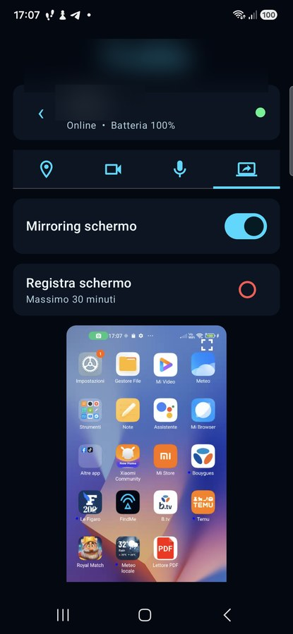

Nella schermata sopra il mirroring è **attivo** sul ricevitore (switch ON) e
l’anteprima verticale mostra lo schermo remoto in tempo reale.

### 8.1 Avviare il mirroring

1. Verificare che il trasmettitore sia online.
2. Verificare sul trasmettitore che **Mirroring schermo** sia **Pronto**.
3. Attivare lo switch **Mirroring schermo** sul ricevitore.
4. Attendere la comparsa dell’anteprima verticale.

Se appare **Mirroring non autorizzato**, aprire FindMe sul trasmettitore,
premere **Riattiva** e confermare la finestra Android.

### 8.2 Fullscreen e registrazione

L’icona nell’angolo dell’anteprima apre la modalità immersiva verticale. Il
contenuto usa proporzioni complete senza ritaglio. Premere il controllo in alto
a destra o Indietro per uscire.

Per registrare:

1. avviare il mirroring;
2. premere REC in **Registra schermo**;
3. premere nuovamente per fermare.

Il file MP4 viene salvato in `Movies/FindMe`, separato dalle registrazioni
camera, con limite di 30 minuti.

Il mirroring non include l’audio interno delle app. Per ascoltare l’ambiente
usare separatamente la tab Audio. Contenuti DRM, app bancarie e finestre
protette possono apparire nere per scelta di Android.

## 9. Messaggio in primo piano

Aprire il quinto tab **Messaggio**, scrivere fino a 500 caratteri e premere
**Invia**. Il comando resta in attesa anche se il trasmettitore è offline. Gli
stati mostrano attesa, permesso mancante, visualizzazione e chiusura.

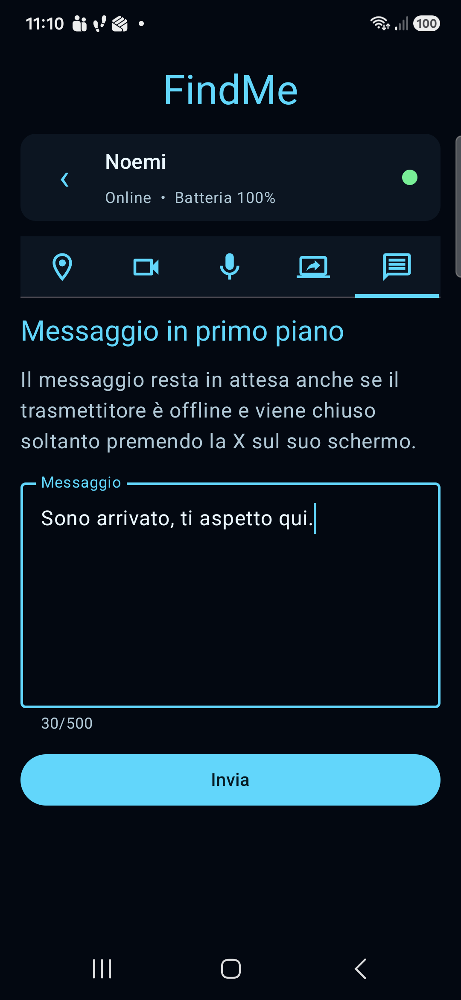

Sul trasmettitore il testo appare al centro in una cornice blu neon sopra le
altre applicazioni. Il messaggio resta visibile finché viene premuta la X. Se
compare l’avviso di permesso mancante, autorizzare **Messaggi in primo piano**
sul trasmettitore: il messaggio pendente apparirà automaticamente.

## 10. Modificare domanda e risposta

In **Configurazioni generali**, scorrere fino alla sezione
**Accesso trasmettitori**. I campi **Domanda** e **Risposta** mostrano i valori
attualmente in uso. Modificarli e premere **Aggiorna**: entrambi sono
obbligatori e la nuova configurazione viene richiesta alle successive aperture
dei trasmettitori associati.

## 11. Cancellare lo storico

In **Configurazioni generali**, scorrere in fondo e premere il pulsante rosso
**Cancella storico posizioni**.

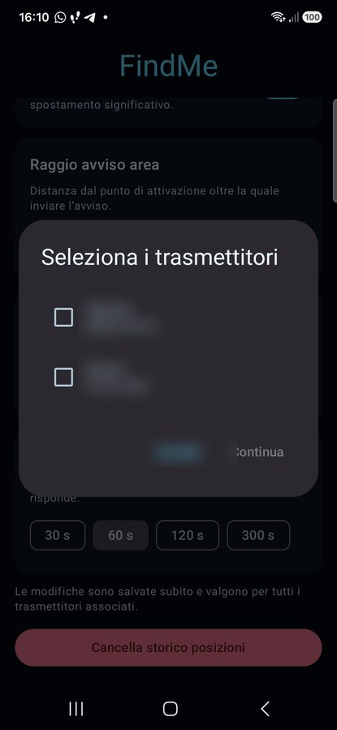

1. Selezionare uno o più trasmettitori.
2. Premere **Continua**.
3. Leggere il riepilogo.
4. Premere **Cancella** nel secondo dialog.

L’operazione è definitiva e riguarda solo i dispositivi selezionati. Il
backend verifica nuovamente che appartengano al ricevitore.

## 12. Schermo spento, cambio app e consumo

Durante streaming o registrazione FindMe mantiene temporaneamente schermo e
CPU attivi. Il blocco manuale del display non deve interrompere la sessione.

Passando volontariamente a un’altra app o tornando alla home FindMe può
chiudere gli stream per evitare consumi non desiderati. Senza audio, video o
schermo attivi non viene mantenuta alcuna connessione LiveKit.

## 13. Risoluzione dei problemi

### Il trasmettitore è offline

- verificare la sua connessione Internet;
- controllare che **Monitoraggio attivo** sia ON;
- verificare restrizioni batteria e avvio automatico sul trasmettitore;
- attendere due intervalli heartbeat;
- aprire l’app trasmettitore per eventuali richieste Android.

### Il dispositivo è online ma i comandi non rispondono

Attendere il polling di sicurezza configurato. FindMe recupera i comandi sia
via realtime sia via controllo REST periodico. Se il problema persiste,
verificare la rete su entrambi i telefoni.

### Video nero o bloccato

- spegnere e riaccendere lo switch video;
- provare a cambiare fotocamera;
- verificare i permessi camera sul trasmettitore;
- chiudere altre app che usano la fotocamera;
- attendere il watchdog automatico.

### Audio assente

- alzare il volume multimediale del ricevitore;
- controllare il permesso microfono del trasmettitore;
- verificare che un messaggio vocale non sia in riproduzione;
- spegnere e riaccendere lo stream.

### Mirroring nero o non disponibile

- riattivare MediaProjection sul trasmettitore;
- verificare che lo stato sia **Pronto**;
- ricordare che contenuti protetti possono restare neri;
- dopo un riavvio concedere nuovamente il consenso Android.

### La mappa non appare

- verificare Internet sul ricevitore;
- attendere il caricamento OpenFreeMap;
- verificare che esista una posizione;
- uscire e rientrare nel dettaglio se il renderer non viene aggiornato.

### Registrazione o foto non visibile

Controllare le raccolte:

- foto: `Pictures/FindMe`;
- video e schermo: `Movies/FindMe`;
- audio: `Music/FindMe`.

Attendere alcuni secondi perché la galleria aggiorni l’indice. Una
registrazione interrotta per errore viene scartata per non lasciare file
parziali.

### Messaggio vocale non riprodotto

- verificare che duri fra 1 e 60 secondi;
- controllare la rete;
- attendere il ritorno online del trasmettitore;
- verificare il feedback di stato;
- registrare un nuovo messaggio se lo stato finale è fallito.

## 14. Checklist rapida

- [ ] Ricevitore connesso a Internet.
- [ ] Trasmettitore associato e online.
- [ ] Frequenze tracking configurate.
- [ ] Notifiche del ricevitore autorizzate.
- [ ] Posizione visibile sulla mappa.
- [ ] Video, audio e schermo spenti quando non servono.
- [ ] File registrati presenti nelle raccolte FindMe.
- [ ] Avviso area configurato e testato, se utilizzato.

