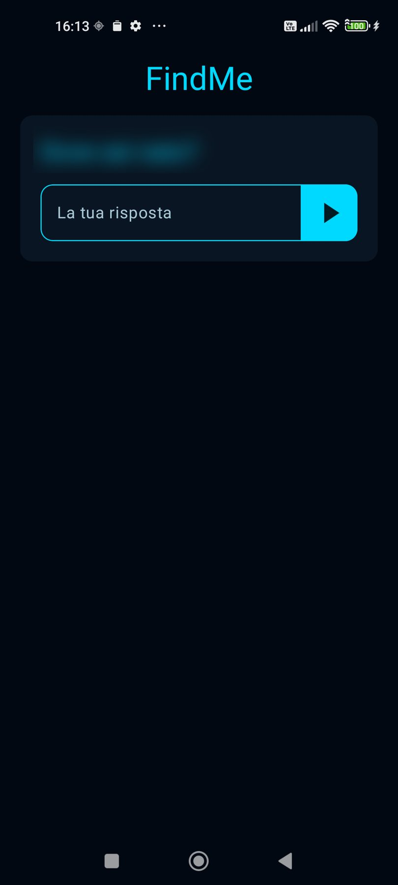
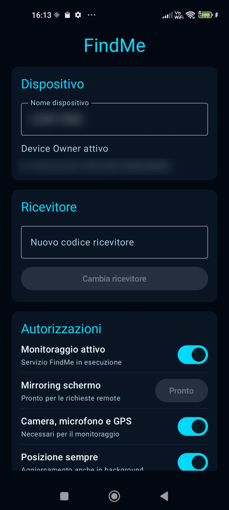

# FindMe — Manuale utente Trasmettitore

**Versione app:** 0.5.0 · **Manuale:** settembre 2025

| Documento correlato | Collegamento |
| --- | --- |
| Manuale ricevitore | [`MANUALE_UTENTE_RICEVITORE.md`](MANUALE_UTENTE_RICEVITORE.md) |
| Analisi funzionale / tecnica | [`ANALISI_FUNZIONALE.md`](ANALISI_FUNZIONALE.md) · [`ANALISI_TECNICA.md`](ANALISI_TECNICA.md) |

## 1. A cosa serve

L’app FindMe Trasmettitore viene installata sul telefono da localizzare e
monitorare. Quando il monitoraggio è attivo, il telefono:

- invia periodicamente posizione, batteria e stato online;
- rende disponibili, solo su richiesta del ricevitore, fotocamere, microfono e
  schermo;
- può riprodurre messaggi vocali inviati dal ricevitore;
- tenta automaticamente di recuperare rete, sessione e collegamenti interrotti.

Il telefono trasmettitore deve appartenere al proprietario del sistema e deve
essere configurato rispettando le autorizzazioni Android e la normativa
applicabile. La notifica permanente di monitoraggio e gli indicatori privacy
di Android sono normali e non devono essere rimossi.

> Le schermate di questo manuale provengono da un dispositivo reale. Codici,
> identificativi, nomi e posizioni sono stati oscurati per tutelare la privacy.

## 2. Requisiti prima dell’uso

Verificare che:

1. il telefono abbia una connessione Wi-Fi o dati;
2. FindMe sia installato o sia stato configurato tramite QR Device Owner;
3. sia disponibile il codice di associazione mostrato dal ricevitore;
4. camera, microfono, posizione e notifiche possano essere autorizzati;
5. FindMe sia escluso dalle limitazioni aggressive della batteria.

La modalità consigliata è **Device Owner**, ottenuta durante la prima
configurazione del telefono tramite QR. In questa modalità FindMe può
ripristinare il servizio dopo un riavvio e Android può pre-approvare i permessi
gestibili. Il consenso per il mirroring dello schermo rimane comunque una
conferma Android obbligatoria.

## 3. Primo avvio e accesso

All’apertura viene mostrata la domanda di sicurezza configurata per il
ricevitore associato.

1. Toccare **La tua risposta**.
2. Digitare la risposta.
3. Premere il triangolo azzurro a destra.

La risposta corretta apre la dashboard. Con una risposta errata l’app rimane
sulla stessa schermata senza mostrare dettagli, per non facilitare tentativi di
accesso. Gli spazi iniziali/finali e le maiuscole non incidono sulla verifica.

Se appare **Provisioning incompleto**, controllare l’associazione al ricevitore
e premere **Riprova**. Se appare un messaggio di connessione temporaneamente
assente, lasciare l’app aperta: il tentativo viene ripetuto automaticamente.

## 4. Dashboard

La dashboard è scorrevole e contiene tre aree: **Dispositivo**,
**Ricevitore** e **Autorizzazioni**.

### 4.1 Nome del dispositivo

Nel campo **Nome dispositivo** è possibile assegnare un nome riconoscibile al
telefono.

1. Toccare il campo.
2. Sostituire il nome.
3. Chiudere la tastiera o toccare fuori dal campo.

La modifica viene salvata durante la digitazione. Sul ricevitore può essere
mostrato anche un alias indipendente.

Sotto il nome compare:

- **Device Owner attivo**, se la configurazione amministrata è completa;
- **Modalità standard**, se l’app è stata installata normalmente;
- l’ID tecnico dell’installazione.

### 4.2 Associare o cambiare ricevitore

La configurazione tramite QR associa normalmente il telefono in automatico.
Per cambiare associazione manualmente:

1. leggere il **Codice di associazione** dalla home del nuovo ricevitore;
2. inserirlo nel campo **Nuovo codice ricevitore**;
3. verificare che contenga esattamente 10 caratteri;
4. premere **Cambia ricevitore**;
5. rispondere alla domanda di sicurezza del nuovo ricevitore.

Il codice viene convertito automaticamente in maiuscolo. Il cambio sostituisce
la precedente associazione: un trasmettitore può appartenere a un solo
ricevitore alla volta.

## 5. Autorizzazioni e monitoraggio

Scorrendo la dashboard si raggiunge la card **Autorizzazioni**.

Nella schermata sopra **Mirroring schermo** risulta **Pronto**: Android ha già
concesso MediaProjection e il ricevitore può richiedere lo schermo.

### 5.1 Monitoraggio attivo

Lo switch principale avvia o arresta il servizio FindMe.

- **ON**: posizione, heartbeat e ricezione comandi restano attivi in
  background.
- **OFF**: il telefono non viene più monitorato e risulterà offline dopo il
  tempo previsto.

Prima dell’attivazione devono essere disponibili camera, microfono e GPS. In
Device Owner il valore ON viene ricordato e il servizio viene riavviato dopo
riavvio del telefono o aggiornamento dell’app.

Non usare abitualmente OFF/ON per recuperare la connessione: FindMe possiede
retry automatici. Farlo solo durante manutenzione o seguendo una procedura di
diagnosi.

### 5.2 Mirroring schermo

Gli stati possibili sono:

- **Non autorizzato**: è necessario premere **Riattiva**;
- **Attivazione in corso**: attendere la finestra Android;
- **Pronto**: lo schermo può essere richiesto dal ricevitore;
- **Streaming**: il ricevitore sta visualizzando lo schermo.

Per autorizzare:

1. attivare prima monitoraggio e permessi;
2. premere **Riattiva**;
3. nella finestra Android premere **Avvia adesso**, **Condividi** o la voce
   equivalente;
4. verificare che lo stato diventi **Pronto**.

Il consenso MediaProjection può dover essere ripetuto dopo riavvio, arresto
del processo, aggiornamento o revoca. Non è tecnicamente concedibile per sempre,
neppure in Device Owner.

### 5.3 Camera, microfono e GPS

Lo switch deve essere ON. Alla prima attivazione Android può chiedere più
conferme:

- fotocamera;
- microfono;
- posizione precisa.

Se si prova a disattivarlo, FindMe apre le impostazioni Android dell’app:
Android non consente a un’app di revocare direttamente i propri permessi.

### 5.4 Posizione sempre

Consente aggiornamenti affidabili anche con l’interfaccia chiusa. Se Android
apre una pagina di sistema, scegliere **Consenti sempre** o l’opzione
equivalente.

### 5.5 Nessuna restrizione batteria

Deve risultare ON. Questa impostazione evita che Android sospenda heartbeat e
connessione durante standby o schermo spento.

Su Xiaomi/MIUI/HyperOS controllare anche:

1. **Impostazioni > App > FindMe > Risparmio batteria**;
2. selezionare **Nessuna restrizione**;
3. abilitare l’avvio automatico, se presente.

Altri produttori possono offrire voci simili per app protette, attività in
background o sospensione automatica.

### 5.6 Notifiche

Questo switch gestisce esclusivamente le notifiche FindMe. Con monitoraggio
attivo Android mostra una notifica foreground persistente, normalmente
intitolata **Monitoraggio FindMe attivo**. È necessaria per mantenere il
servizio in background e può non essere eliminabile.

Disabilitare le notifiche non rende invisibile il monitoraggio: Android può
continuare a mostrare indicatori privacy e informazioni sul servizio.

## 6. Uso quotidiano

Una volta completata la configurazione:

1. lasciare **Monitoraggio attivo** su ON;
2. lasciare attivi permessi, posizione sempre e nessuna restrizione batteria;
3. verificare **Mirroring schermo: Pronto** se si desidera questa funzione;
4. chiudere normalmente l’interfaccia: il servizio continua in background;
5. mantenere disponibile una connessione a Internet.

Audio, video e schermo non vengono trasmessi continuamente. Il collegamento
multimediale viene aperto solo quando il ricevitore accende il relativo switch
e viene chiuso quando l’ultimo stream viene spento o si lascia il dettaglio.

## 7. Messaggi vocali ricevuti

Il ricevitore può inviare messaggi vocali asincroni fino a 60 secondi. Quando
arriva un messaggio:

- viene scaricato tramite connessione protetta;
- viene riprodotto al volume basso, medio o alto scelto dal ricevitore;
- il microfono del trasmettitore viene sospeso temporaneamente per evitare eco;
- volume e microfono vengono ripristinati al termine.

Se il telefono è offline, il messaggio resta in attesa e viene consegnato al
ritorno della connessione.

## 8. Riavvio, standby e recupero automatico

FindMe esegue automaticamente:

- retry progressivi dopo perdita di rete;
- rinnovo della sessione;
- ascolto realtime e polling di sicurezza dei comandi;
- ricostruzione del collegamento multimediale se non risponde;
- heartbeat periodici anche durante standby.

In Device Owner il servizio riparte dopo il riavvio. Il mirroring richiede
invece una nuova conferma Android. In modalità standard può essere necessario
aprire FindMe almeno una volta dopo il riavvio.

## 9. Risoluzione dei problemi

### Il telefono risulta offline

1. Verificare Wi-Fi o dati mobili aprendo una pagina Internet.
2. Controllare che **Monitoraggio attivo** sia ON.
3. Controllare **Nessuna restrizione batteria** e le impostazioni proprietarie
   del produttore.
4. Attendere almeno due intervalli heartbeat.
5. Aprire FindMe per verificare eventuali richieste Android.
6. Solo come ultima prova, spegnere e riaccendere il monitoraggio.

### Posizione assente o non aggiornata

- attivare la localizzazione del telefono;
- verificare posizione precisa e **Posizione sempre**;
- provare all’aperto;
- controllare che il risparmio batteria non limiti FindMe.

### Video o audio non partono

- verificare che camera, microfono e GPS siano autorizzati;
- chiudere altre app che stanno usando camera o microfono;
- controllare la rete;
- attendere il recupero automatico;
- riavviare FindMe solo se il problema persiste.

### Mirroring non disponibile

1. Aprire la dashboard.
2. Scorrere fino a **Mirroring schermo**.
3. Premere **Riattiva**.
4. Confermare la finestra Android.
5. Riprovare dal ricevitore.

Schermate DRM, app bancarie, finestre protette e alcune schermate di sistema
possono apparire nere per una protezione Android. L’audio interno del telefono
non viene acquisito.

### Il servizio si ferma dopo alcuni minuti

Ricontrollare l’esenzione batteria e, soprattutto su Xiaomi, l’impostazione
proprietaria **Nessuna restrizione** e l’avvio automatico. Verificare inoltre
che l’app non sia stata terminata manualmente dalle impostazioni Android.

## 10. Checklist finale

- [ ] Device Owner attivo, se previsto.
- [ ] Ricevitore corretto associato.
- [ ] Monitoraggio attivo.
- [ ] Camera, microfono e GPS autorizzati.
- [ ] Posizione sempre autorizzata.
- [ ] Nessuna restrizione batteria.
- [ ] Notifiche configurate.
- [ ] Mirroring pronto, se richiesto.
- [ ] Il dispositivo compare online nel ricevitore.

